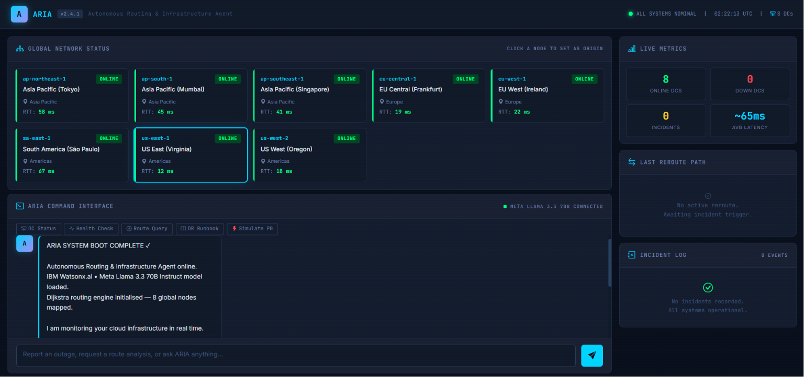

# 🌐 Autonomous Cloud Failover Agent — SRE Assistant

### An AI-Powered Platform for Intelligent Cloud Failover & Disaster Recovery

#### Featuring **ARIA** (Autonomous Routing & Infrastructure Agent)

**Built with:** IBM watsonx.ai • Meta Llama 3.3 70B Instruct • Dijkstra's Shortest Path Algorithm

---


> **Autonomous Cloud Failover Agent — SRE Assistant** is an intelligent cloud operations platform designed to assist Site Reliability Engineers during infrastructure failures. At the core of the platform is **ARIA (Autonomous Routing & Infrastructure Agent)**, an AI assistant that combines deterministic routing algorithms with Large Language Models to automate cloud failover analysis, disaster recovery planning, and infrastructure incident response.

<p align="center">
  
</p>

---

# 📖 Overview

The **Autonomous Cloud Failover Agent** simulates a globally distributed cloud infrastructure and demonstrates how Artificial Intelligence can assist Site Reliability Engineers (SREs) in responding to infrastructure outages quickly, accurately, and transparently.

At the heart of the platform is **ARIA (Autonomous Routing & Infrastructure Agent)**, an intelligent assistant that orchestrates incident detection, failover route computation, and operational response generation.

Unlike conventional AI chatbots that rely solely on Large Language Models for decision-making, ARIA follows a **hybrid AI architecture**. Critical routing decisions are computed deterministically using **Dijkstra's Shortest Path Algorithm**, while **Meta Llama 3.3 70B Instruct**, hosted on **IBM watsonx.ai**, interprets those validated results to generate professional, human-readable Site Reliability Engineering reports.

When an operator reports an infrastructure incident, ARIA performs the following workflow:

1. 🛰️ Detects and classifies the reported infrastructure incident.
2. 📍 Identifies the affected cloud data center from natural language.
3. 🚫 Removes the failed node from the cloud topology.
4. 🧮 Computes the optimal failover path using Dijkstra's Shortest Path Algorithm.
5. 📊 Evaluates alternative routing options based on network latency.
6. 🤖 Generates a structured incident response report using Meta Llama 3.3 through IBM watsonx.ai.
7. 📝 Records the incident and updates the operational dashboard.

By separating deterministic routing from AI-generated operational guidance, ARIA delivers **explainable**, **reliable**, and **production-oriented** recommendations while preserving transparency in infrastructure decision-making.

### 🕹️ Live System Demonstration
<p align="center">
  
</p>

## ✨ Key Features

### 🤖 AI-Powered Incident Analysis
- Understands natural language outage reports from cloud operators.
- Identifies failed data centers and classifies infrastructure incidents.
- Generates structured, production-oriented SRE incident reports using **Meta Llama 3.3 70B Instruct** through **IBM watsonx.ai**.

### 🧮 Intelligent Failover Routing
- Custom implementation of **Dijkstra's Shortest Path Algorithm**.
- Computes the lowest-latency failover route in real time.
- Automatically excludes failed nodes from routing decisions.
- Provides alternative recovery paths when multiple routes are available.

### 🌐 Cloud Infrastructure Simulation
- Simulates a globally distributed cloud network with interconnected data centers.
- Maintains weighted latency graphs representing inter-region network links.
- Enables realistic disaster recovery and failover scenarios.

### 📊 Interactive Operations Dashboard
- Chat-based interface for reporting infrastructure incidents.
- Real-time visualization of cloud topology.
- Incident history and operational monitoring dashboard.
- Data center status and failover insights.

### 🛡️ SRE-Oriented Decision Support
- Estimates Recovery Time Objectives (RTO).
- Suggests rollback procedures and recovery actions.
- Produces explainable recommendations backed by deterministic routing logic.
- Follows operational safety protocols for infrastructure incident management.

### 🔌 RESTful API Support
- Chat endpoint for AI-powered incident analysis.
- Dijkstra routing endpoint for direct route computation.
- Cloud topology API.
- Incident history API.
- Health monitoring endpoint.

## 🏗️ System Architecture

```text
                         ┌─────────────────────────────┐
                         │        Cloud Operator       │
                         │ Reports an Infrastructure   │
                         │        Incident             │
                         └──────────────┬──────────────┘
                                        │
                                        ▼
                          ┌─────────────────────────┐
                          │  ARIA Chat Interface    │
                          │   (Flask + Bootstrap)   │
                          └──────────────┬──────────┘
                                         │
                    ┌────────────────────┴────────────────────┐
                    │                                         │
                    ▼                                         ▼
      ┌───────────────────────────┐            ┌──────────────────────────┐
      │ Incident Detection Engine │            │ Cloud Topology Manager   │
      │ • NLP Parsing             │            │ • Data Center Graph      │
      │ • DC Identification       │            │ • Latency Matrix         │
      │ • Intent Classification   │            │ • Network State          │
      └──────────────┬────────────┘            └─────────────┬────────────┘
                     │                                       │
                     └──────────────────┬────────────────────┘
                                        ▼
                          ┌─────────────────────────┐
                          │ Dijkstra Routing Engine │
                          │ • Exclude Failed Node   │
                          │ • Compute Best Route    │
                          │ • Rank Alternatives     │
                          └──────────────┬──────────┘
                                         │
                                         ▼
                      ┌───────────────────────────────────┐
                      │ IBM watsonx.ai                    │
                      │ Meta Llama 3.3 70B Instruct       │
                      │                                   │
                      │ Generates:                        │
                      │ • Incident Analysis               │
                      │ • Failover Report                 │
                      │ • RTO Estimate                    │
                      │ • Rollback Procedure              │
                      └──────────────┬────────────────────┘
                                     │
                                     ▼
                  ┌───────────────────────────────────────┐
                  │ Dashboard & Incident Management       │
                  │ • AI Response                         │
                  │ • Failover Summary                    │
                  │ • Incident Log                        │
                  │ • Data Center Status                  │
                  └───────────────────────────────────────┘
```

### Hybrid AI Decision Pipeline

ARIA follows a **hybrid AI architecture** that combines deterministic algorithms with generative AI.

Instead of relying on the language model to determine routing decisions, the application separates responsibilities:

| Component | Responsibility |
|-----------|----------------|
| **Incident Detection** | Identifies the failed data center from natural language input. |
| **Dijkstra Routing Engine** | Computes the optimal failover route using the network latency graph. |
| **IBM watsonx.ai (Meta Llama 3.3 70B)** | Interprets routing results and generates a structured SRE incident report. |
| **Incident Manager** | Records incidents and updates the operational dashboard. |

This separation ensures that routing decisions remain **deterministic, explainable, and reproducible**, while the AI model focuses on delivering human-readable operational guidance and recovery recommendations.

## 🔄 How ARIA Works

ARIA follows an end-to-end intelligent incident response workflow that combines deterministic routing algorithms with AI-assisted operational guidance.

### Step 1 — Operator Reports an Incident

The cloud operator reports an infrastructure issue through the interactive chat interface.

**Example**

```text
Tokyo data center is down. Initiate failover.
```

---

### Step 2 — Incident Detection

ARIA analyzes the operator's message to:

- Detect infrastructure incidents
- Identify the affected data center
- Determine whether failover is required
- Extract routing context

**Detected Incident**

```text
Incident Type : Data Center Failure

Affected Node : ap-northeast-1 (Tokyo)

Severity      : Critical
```

---

### Step 3 — Network Graph Update

The failed data center is temporarily removed from the cloud topology.

ARIA rebuilds the routing graph by excluding the unavailable node before performing path computation.

```text
Cloud Topology
      │
      ▼
Remove Failed Node
      │
      ▼
Updated Network Graph
```

---

### Step 4 — Intelligent Route Computation

ARIA executes **Dijkstra's Shortest Path Algorithm** on the updated latency graph to determine the optimal failover route.

The routing engine computes:

- Lowest-latency failover path
- Total network latency
- Hop count
- Alternative recovery routes
- Reachability validation

---

### Step 5 — AI-Powered SRE Analysis

The routing results are supplied to **Meta Llama 3.3 70B Instruct** through **IBM watsonx.ai**.

Rather than calculating routes, the AI model interprets the computed results and generates an operational incident report containing:

- Incident Classification
- Infrastructure Impact Analysis
- Optimal Failover Recommendation
- Recovery Time Objective (RTO)
- Rollback Procedure
- Recommended Next Actions

---

### Step 6 — Incident Logging & Dashboard Update

Finally, ARIA returns the generated response to the operator and records the incident for operational tracking.

The dashboard is updated with:

- AI-generated response
- Failed data center
- Recommended failover path
- Alternative routes
- Incident history

### 🔁 End-to-End Workflow

```text
Operator
    │
    ▼
Natural Language Incident
    │
    ▼
Incident Detection
    │
    ▼
Failed DC Identification
    │
    ▼
Update Network Graph
    │
    ▼
Run Dijkstra Algorithm
    │
    ▼
Optimal Failover Route
    │
    ▼
IBM watsonx.ai
(Meta Llama 3.3 70B)
    │
    ▼
Structured SRE Report
    │
    ▼
Dashboard & Incident Log
```

## ⚙️ Technology Stack

ARIA is built using a modern cloud-native technology stack that combines AI, graph algorithms, and web technologies to deliver an intelligent Site Reliability Engineering (SRE) assistant.

| Layer | Technology | Purpose |
|--------|------------|---------|
| **Backend Framework** | Flask 3.x | REST API development and request handling |
| **Programming Language** | Python 3.11+ | Core application logic and routing engine |
| **AI Platform** | IBM watsonx.ai | Foundation model inference |
| **Foundation Model** | Meta Llama 3.3 70B Instruct | Incident analysis and SRE report generation |
| **Routing Algorithm** | Dijkstra's Shortest Path Algorithm | Optimal failover path computation |
| **Data Structure** | Priority Queue (`heapq`) | Efficient shortest-path calculations |
| **Frontend** | HTML5, Bootstrap 5, JavaScript | Interactive operations dashboard |
| **Configuration** | python-dotenv | Secure environment variable management |
| **Communication** | RESTful APIs (JSON) | Client-server communication |
| **Deployment** | Docker, Gunicorn, IBM Code Engine | Production deployment options |

---

### Core Technologies

| Technology | Role in ARIA |
|------------|--------------|
| 🤖 **IBM watsonx.ai** | Hosts and serves the Meta Llama foundation model for intelligent incident response generation. |
| 🧠 **Meta Llama 3.3 70B Instruct** | Converts deterministic routing results into structured Site Reliability Engineering reports. |
| 🧮 **Dijkstra's Algorithm** | Calculates the shortest available failover path after excluding failed infrastructure nodes. |
| 🌐 **Flask** | Provides REST APIs, application routing, and backend orchestration. |
| 📊 **Bootstrap & JavaScript** | Powers the interactive cloud monitoring dashboard and chat interface. |

## 📂 Project Structure

```text
ARIA/
│
├── app.py                  # Flask backend, AI orchestration, Dijkstra routing engine, and REST APIs
├── templates/
│   └── index.html          # Interactive dashboard, chat interface, cloud topology, and incident monitoring
├── requirements.txt        # Python dependencies
├── .env.example            # Environment variable template
├── .env                    # Local configuration (not committed)
├── README.md               # Project documentation
└── __pycache__/            # Auto-generated Python cache files
```

### Directory Overview

| File / Directory | Description |
|------------------|-------------|
| **app.py** | Main application containing the Flask server, IBM watsonx.ai integration, Meta Llama inference, Dijkstra routing engine, incident detection logic, and REST API endpoints. |
| **templates/index.html** | Frontend dashboard providing the ARIA command interface, cloud topology visualization, live metrics, reroute path visualization, and incident log. |
| **requirements.txt** | Lists all required Python packages. |
| **.env.example** | Sample configuration file for IBM watsonx.ai credentials and application settings. |
| **.env** | Stores API keys, project credentials, and secret configuration. This file should never be committed to version control. |
| **README.md** | Project documentation and setup instructions. |
| **__pycache__/** | Automatically generated Python bytecode cache. Not part of the source code. |
```

## 🚀 Getting Started

Follow these steps to set up ARIA on your local machine.

### 1️⃣ Clone the Repository

```bash
git clone https://github.com/<your-username>/autonomous-cloud-failover-agent.git
cd aria
```

> Replace `<your-username>` with your GitHub username after publishing the repository.

---

### 2️⃣ Create a Virtual Environment

**Windows**

```bash
python -m venv .venv
.venv\Scripts\activate
```

**Linux / macOS**

```bash
python3 -m venv .venv
source .venv/bin/activate
```

---

### 3️⃣ Install Dependencies

```bash
pip install -r requirements.txt
```

---

### 4️⃣ Configure Environment Variables

Copy the example environment file.

**Windows**

```bash
copy .env.example .env
```

**Linux / macOS**

```bash
cp .env.example .env
```

Open the `.env` file and configure the following variables:

```env
IBM_API_KEY=your_ibm_cloud_api_key

WATSONX_PROJECT_ID=your_project_id

WATSONX_URL=https://us-south.ml.cloud.ibm.com

MODEL_ID=meta-llama/llama-3-3-70b-instruct

FLASK_SECRET_KEY=your_secret_key
```

---

### 5️⃣ Launch the Application

```bash
python app.py
```

The application will start locally.

Open your browser and navigate to:

```
http://localhost:5000
```

## 🔑 Environment Variables

| Variable | Description |
|-----------|-------------|
| `IBM_API_KEY` | IBM Cloud API Key used for authentication. |
| `WATSONX_PROJECT_ID` | IBM watsonx.ai Project ID. |
| `WATSONX_URL` | Regional watsonx.ai endpoint. |
| `MODEL_ID` | Foundation model used for inference (default: Meta Llama 3.3 70B Instruct). |
| `FLASK_SECRET_KEY` | Secret key used by the Flask application. |

> **Security Note:** Never commit your `.env` file to GitHub. Only commit `.env.example`.

## 💬 Example Usage

### Example 1 — Regional Outage Detection

**Operator**

```text
The Tokyo region is unreachable. Please reroute traffic immediately.
```

**ARIA**

```text
🚨 INCIDENT CLASSIFICATION
P0 Incident – Regional Unreachability

Affected Node:
ap-northeast-1 (Tokyo)

Recommended Route:
US East (Virginia) → US West (Oregon)

Latency:
72 ms (1 Hop)

Estimated RTO:
15 minutes
```

---

### Example 2 — Infrastructure Failure

**Operator**

```text
Frankfurt region is offline due to a power outage.
```

**ARIA**

```text
• Detects Frankfurt outage
• Excludes eu-central-1 from topology
• Computes new shortest route
• Generates rollback procedure
• Provides operational recommendations
```

---

### Example 3 — Failover Strategy Explanation

**Operator**

```text
Looks like Mumbai is completely offline.
Can you recommend a failover strategy?
```

**ARIA**

```text
Primary Failover:
US East (Virginia)
        ↓
US West (Oregon)

Reason:
✓ Lowest latency
✓ Healthy destination
✓ Shortest Dijkstra path
✓ Geographic redundancy
```

---

### Example 4 — Multi-Region Failure

**Operator**

```text
Tokyo and Singapore are both offline.
```

**ARIA**

```text
• Requests clarification if required
• Recomputes network graph
• Excludes failed nodes
• Calculates alternative routing
• Generates updated incident report
```

## 🖥 Dashboard Components

The web interface provides a real-time operational dashboard inspired by modern cloud infrastructure monitoring tools.

| Component | Description |
|-----------|-------------|
| 🌍 Global Network Status | Displays all cloud regions with live operational status |
| 📈 Live Metrics | Online data centers, outages, latency statistics |
| ⚠ Incident Banner | Highlights active infrastructure incidents |
| 🤖 ARIA Command Interface | Natural language interaction with the AI assistant |
| 🛣 Last Reroute Path | Visualizes the latest failover route computed by Dijkstra |
| 📋 Incident Log | Chronological history of simulated infrastructure events |

The dashboard automatically updates routing information whenever a failover simulation is triggered, allowing operators to visualize infrastructure changes in real time.

## ⚙️ How It Works

The failover workflow follows a deterministic pipeline:

```text
Operator Input
      │
      ▼
Natural Language Processing
      │
      ▼
Failure Detection
      │
      ▼
Update Network Graph
(Remove Failed Node)
      │
      ▼
Dijkstra Shortest Path
      │
      ▼
Generate Routing Metadata
      │
      ▼
Inject Context into
Meta Llama 3.3 70B
      │
      ▼
Professional SRE Report
      │
      ▼
Dashboard + Incident Log
```

This architecture separates deterministic routing logic from language generation, ensuring that infrastructure decisions are algorithmically computed while the AI focuses solely on reasoning and report generation.

# 📷 Application Preview

The dashboard provides a real-time operational view of the simulated cloud infrastructure, allowing operators to monitor regional health, initiate failover simulations, and review AI-generated incident reports.

## Main Dashboard

<p align="center">
  
</p>

Features visible:

- 🌐 Global Data Center Status
- 📊 Live Infrastructure Metrics
- 🤖 ARIA Command Interface
- 🔀 Last Computed Failover Path
- 📝 Incident Log
- 🚨 Active Incident Banner

---

## AI Incident Response

<p align="center">
  
</p>

Example SRE report generated by ARIA after detecting a regional outage.

---

## Network Routing Dashboard

<p align="center">
  
</p>

Latency-aware routing visualization across all cloud regions.

---

# 🔌 REST API

ARIA exposes RESTful endpoints that allow external systems to interact with the routing engine and AI assistant.

| Method | Endpoint | Description |
|----------|----------|-------------|
| GET | `/` | Launch dashboard |
| POST | `/api/chat` | AI-powered incident analysis |
| POST | `/api/dijkstra` | Compute optimal routing path |
| GET | `/api/graph` | Retrieve network topology |
| GET | `/api/incidents` | Retrieve incident history |
| GET | `/api/health` | Application health status |

---

## Example Request

```http
POST /api/chat
Content-Type: application/json
```

```json
{
    "message": "Tokyo region is unreachable. Initiate failover.",
    "source_dc": "us-east-1",
    "history": []
}
```

---

## Example Response

```json
{
    "reply": "... AI generated SRE report ...",
    "detected_dc": "ap-northeast-1",
    "incident": {...},
    "failover_data": {...}
}
```

---

# 🧮 Core Algorithms

ARIA combines deterministic routing algorithms with LLM-based reasoning.

## Dijkstra's Shortest Path

Used for:

- Lowest latency path computation
- Automatic failover routing
- Failed node exclusion
- Multi-hop route optimisation

Time Complexity

```
O((V + E) log V)
```

using a priority queue (heap).

---

## Natural Language Incident Detection

The Meta Llama 3.3 70B model identifies:

- Failed data center
- Incident severity
- Infrastructure context
- Operator intent

---

## Hybrid Decision Architecture

Unlike autonomous AI systems that allow the language model to make operational decisions, ARIA separates responsibilities:

```
Operator
    │
    ▼
LLM extracts outage information
    │
    ▼
Python validates request
    │
    ▼
Dijkstra computes optimal path
    │
    ▼
Routing results injected into prompt
    │
    ▼
LLM generates professional SRE report
```

This architecture improves reliability, explainability, and operational safety.

---

---

## 📄 License

This project is licensed under the MIT License.

---

## 🙏 Acknowledgements

- IBM SkillsBuild
- IBM watsonx.ai
- Meta Llama 3.3
- Flask
- Bootstrap

---

⭐ If you found this project interesting, consider giving it a star.
